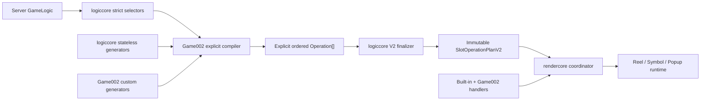

# Slot Operation Effect Model 与游戏显式编排重构

> 状态：Task 178 的 V2 runtime、consumer 与 authoring 切换已实施；本文是当前
> `SlotOperationPlanV2` 架构合同。Game002 已改为自主调用原子 generator 并直接排列
> BaseGame、transform 与显式 FreeGame operations；配置型 consumer 暂时仍通过
> `compileConfiguredSlotRoundOperationPlanV2()` 生成 V2 trace，后续必须把这段固定排列下沉到
> consumer，不能把它扩展成新的 shared 业务编排层。
>
> V1 public/runtime 路径已删除；历史设计只保留在 `docs/slot-operation-plan.md`，不得恢复
> compatibility alias 或双轨执行。

## 结论

当前合同把“服务器数据解析”和“最终 operation 编排”从固定 profile compiler 中拆开：

- `logiccore` 提供 strict component selector、无状态 operation generator、snapshot mutation
  算法和最终 plan finalizer；
- 游戏 app 显式选择 component、传入 generator 所需数据并拥有最终 `operation[]` 的排列权；
- 游戏侧只表达 component 选择、业务参数和 operation 顺序，不手写 source evidence、ID、索引、
  capability 聚合、freeze 或通用 snapshot 转换样板代码；
- operation 首先按它对渲染状态的影响分类，而不是强制所有 kind 都声明相同的
  `input/output`；
- `rendercore` 继续按数组顺序执行 handler lifecycle，不理解游戏 component、symbol 或金额语义；
- 只有真正修改 slot 状态的 operation 才声明 `input/output` 和 mutation position。

目标流程如下：



## 已移除的旧问题

Task 178 首版的 Game002 round 编译曾分为两遍：

1. `logiccore.compileSlotRoundOperationPlan()` 根据固定 profile 遍历 server round，生成
   `spin -> win -> dropdown -> refill -> settled-transform -> completion`；
2. game002 再遍历通用 operation，将 `slot:settled-transform` 替换为 WL increment、
   wild multiplier、WM→CN、coin multiplier、CM→CN 和 CO collect 等游戏原子 operation，
   必要时再追加 FreeGame operation。

该结构能够严格验证当前固定流程，但存在三个长期限制。

### 固定 profile 同时承担了解析和编排

`logiccore` 不仅解析 server component，还替游戏决定了 operation 的大顺序。游戏若要在 win
前后、dropdown/refill 之间或多个 server step 之间插入业务 operation，只能对生成后的数组
再次 `flatMap`、重排和重建索引。

### 所有 operation 被迫声明假的状态转换

V1 强制每项都有 `input/output`，因此出现：

```text
spin.input == spin.output
win.input == win.output
completion.input == completion.output
```

这些相等字段只满足统一结构，不表达真实渲染语义。Spin 是从当前客户端画面开始滚动并落到
server snapshot；Win 是在当前场景上播放结算表现，不产生新的场景状态。

### 通用位置字段会混淆表现目标和状态 mutation

Win result position 表示“哪些 symbol 参与表现”；WL/WM/CM position 表示“哪些 occurrence
发生状态改变”。两者不应被建模为同一种公共 `positions` 数据袋。

## 设计原则

1. 游戏拥有最终 operation 顺序，shared package 不替游戏决定业务流程。
2. component 选择、server index 解析和 schema 校验继续属于 `logiccore`。
3. generator 是无状态纯函数，不依赖隐藏的 `composer.current`。
4. 游戏显式传入 generator 所需的 snapshot、component selection 和业务配置。
5. finalizer 验证整个数组的状态连续性，但不修改、补齐或重新排序游戏提供的 operation。
6. component 未触发与 component 已触发但数据非法必须严格区分。
7. renderer 只消费 finalized plan；不得在执行期插入、删除或重排 operation。
8. operation 类型只声明自身语义必需的状态和位置字段。
9. 灵活性不能以复杂的游戏 app 代码为代价；常规 Spin/Win/dropdown/refill 必须保持一行式调用，
   游戏只在真正的专属业务 operation 中编写专属 generator。

## V2 Operation 分类

V2 使用 discriminated union，公共 envelope 不再包含 `input/output`：

```ts
interface SlotOperationEnvelope<
  Kind extends string = string,
  Source extends SlotOperationSource = SlotOperationSource,
  Payload = unknown,
> {
  readonly id: string;
  readonly kind: Kind;
  readonly version: number;
  readonly operationIndex: number;
  readonly source: Source;
  readonly payload: Payload;
  readonly requiredCapabilities: readonly string[];
  readonly commit: "atomic";
}
```

### Scene landing operation

Scene landing 从当前 renderer 状态开始，结束时建立一份可信 slot snapshot。它只有
`output`，没有假的逻辑 `input`。

```ts
interface SlotSceneLandingOperation extends SlotOperationEnvelope {
  readonly effect: "scene-landing";
  readonly output: SlotOperationSnapshot;
}
```

典型 kind：

- `slot:spin`；
- 明确替换整份可见场景的 mode/bonus landing；
- 从本地 authored snapshot 建立 viewer 初始画面的 operation。

`slot:spin` handler 可以读取当前 reel runtime 开始滚动，但该客户端画面不是 server execution
plan 的逻辑 input，不能被序列化为猜测的 snapshot。

### Presentation operation

Presentation operation 在当前画面上播放效果，完成后不改变 slot snapshot，因此没有
`input/output`：

```ts
interface SlotPresentationOperation<
  Payload = unknown,
> extends SlotOperationEnvelope<string, SlotOperationSource, Payload> {
  readonly effect: "presentation";
  readonly targets?: readonly SlotPresentationTarget[];
}

interface SlotPresentationTarget {
  readonly position: SlotOperationPosition;
  readonly occurrenceId?: string;
  readonly role?: string;
}
```

典型 kind：

- `slot:win`；
- `slot:completion`；
- win amount、award、anticipation 或 transition presentation；
- 不改变 symbol code/value/identity/position 的游戏动画。

`targets` 表示表现对象，不表示 mutation。Win 的 targets 必须从选中的 result/component
严格读取；没有 position 的 presentation 可以省略该字段。

### State mutation operation

只有修改 scene、presentation value、occurrence identity 或 position 的 operation 才声明状态
转换：

```ts
interface SlotStateMutationOperation<
  Mutation extends SlotStateMutation = SlotStateMutation,
  Payload = unknown,
> extends SlotOperationEnvelope<string, SlotOperationSource, Payload> {
  readonly effect: "state-mutation";
  readonly input: SlotOperationSnapshot;
  readonly output: SlotOperationSnapshot;
  readonly mutations: readonly Mutation[];
}
```

典型 kind：

- `slot:dropdown`、`slot:refill`；
- `game002:wl-increment`；
- `game002:wild-multiplier`；
- `game002:wm-to-cn`、`game002:cm-to-cn`；
- `game002:coin-multiplier`、`game002:co-collect`。

Mutation 使用 strict union，位置只放在真正需要它的 mutation 中：

```ts
type SlotStateMutation =
  | {
      readonly kind: "remove";
      readonly position: SlotOperationPosition;
      readonly occurrenceId: string;
    }
  | {
      readonly kind: "relocate";
      readonly source: SlotOperationPosition;
      readonly target: SlotOperationPosition;
      readonly occurrenceId: string;
    }
  | {
      readonly kind: "replace";
      readonly position: SlotOperationPosition;
      readonly inputOccurrenceId: string;
      readonly outputCode: number;
      readonly outputValue: number | null;
    }
  | {
      readonly kind: "value-update";
      readonly position: SlotOperationPosition;
      readonly occurrenceId: string;
      readonly inputValue: number | null;
      readonly outputValue: number | null;
    };
```

具体 generator 可以使用更窄的 mutation union，但不得把 renderer callback、Pixi object 或
动画 player 放入 plan。

## Game-owned 显式编排

Game002 compiler 直接构造最终顺序，不再先接收一份固定 profile operation plan 后二次拆分：

```ts
export function compileGame002OperationPlan(
  logic: GameLogic,
  context: Game002OperationCompileContext,
): SlotOperationPlanV2 {
  const server = createSlotOperationServerView(logic, context);

  return server.finalize([
    spin(server.firstStep.require("bg-spin")),
    ...server.steps.flatMap((step) =>
      compactOperations([
        win(step.lastPresent(GAME002_WIN_COMPONENTS)),
        ...game002BeforeDropdown(step),
        dropdown(step.optional("bg-dropdown")),
        ...game002AfterDropdown(step),
        refill(step.optional("bg-refill")),
        ...game002MultiplierOperations(step),
      ]),
    ),
    freeGame(server.lastPresentStep("bg-triggerfg")),
  ]);
}
```

上述代码只是职责示例，不规定 Game002 最终 component 名和流程。正式实现中的精确 component
角色必须来自 Game002 的 versioned profile/config，不能在 shared generator 中硬编码。

`spin()`、`win()`、`dropdown()`、`refill()` 接受 selector 返回的 typed selection，自动完成：

- server source evidence/binding；
- scene/result/otherScene index 的严格读取；
- 通用 snapshot 和 target/mutation 构造；
- absent optional selection 到空 operation 的规范化；
- kind/version、默认 capability 和 draft metadata。

Game002 不应反复调用 `bindComponent()`、`readSnapshot()`、手写 `operationIndex` 或组装公共
envelope。只有 `game002MultiplierOperations()` 等真正含游戏语义的函数留在 app 内。

Game002 可以在任何位置插入 operation：

```ts
operations.push(generateSpinOperation(...));
operations.push(generateGame002PostSpinPresentation(...));
operations.push(generateWinPresentation(...));
operations.push(generateGame002PreDropdownPresentation(...));
operations.push(generateDropdownMutation(...));
operations.push(generateGame002PostDropdownMutation(...));
operations.push(generateRefillMutation(...));
```

是否允许该顺序由 finalizer 根据 effect 和 snapshot 连续性证明，而不是由 fixed profile 预先限制。

## 游戏侧 API 简洁性

### Selection 自带严格 typed view

Selector 不只返回裸 `GameLogicComponent`，而是返回已绑定 step/index/source evidence 的 typed
selection：

```ts
interface PresentComponentSelection<Role extends string = string> {
  readonly presence: "present";
  readonly role: Role;
  readonly source: ServerComponentSelectionEvidence;
  scene(index?: number): SlotSceneSelection;
  otherScene(index?: number): SlotOtherSceneSelection;
  results(): readonly SlotResultSelection[];
  positions(): readonly SlotOperationPosition[];
}

interface AbsentComponentSelection<Role extends string = string> {
  readonly presence: "absent";
  readonly role: Role;
}
```

这些 accessor 仍然严格失败，但 evidence 和原始 index 自动保留。游戏调用 built-in generator
时通常不需要直接访问 accessor：

```ts
win(step.lastPresent(GAME002_WIN_COMPONENTS));
dropdown(step.optional("bg-dropdown"));
```

只有游戏专属 generator 才显式取所需输入：

```ts
function game002MultiplierOperations(
  step: SlotServerStepView,
): readonly SlotOperationDraftV2[] {
  const wm = step.optional("bg-updwl");
  if (wm.presence === "absent") return [];

  return game002WildMultiplier({
    input: wm.scene(),
    values: wm.otherScene(),
    targets: wm.positions(),
  });
}
```

### Generator 返回 draft，Finalizer 补公共元数据

游戏组合的是 draft，而不是完整 finalized operation：

```ts
type SlotOperationDraftV2 =
  | SlotSceneLandingDraft
  | SlotPresentationDraft
  | SlotStateMutationDraft;
```

Draft 不要求游戏提供：

- `id`；
- `operationIndex`；
- 聚合后的 `requiredCapabilities`；
- deep freeze；
- plan `final`；
- 可由 definition 唯一确定的 kind/version 默认字段。

Finalizer 按数组顺序生成稳定 ID/index、聚合 capability、验证状态连续性并 deep freeze。若业务
确实需要稳定外部 ID，generator 可以显式提供业务 key，但不能让每个游戏调用点承担样板代码。

### Optional helper 不制造分支噪音

Built-in generator 接受 absent selection 并返回 `null`，`compactOperations()` 只删除明确的
`null`：

```ts
compactOperations([
  win(step.lastPresent(WIN_COMPONENTS)),
  dropdown(step.optional("bg-dropdown")),
  refill(step.optional("bg-refill")),
]);
```

它不能捕获解析错误，也不能把非法 component 当成 absent。这样游戏代码不需要为每个 optional
component 写重复的 `if`，同时保留严格失败语义。

### 不要求所有游戏复制 round 循环

LogicCore 可以提供不决定业务顺序的轻量遍历工具，例如 `server.steps.flatMap()`、
`compactOperations()` 和 typed step view；不得重新提供一个内部固定排列
`win -> dropdown -> refill -> transform` 的高级函数。游戏可以把自己的常用排列封装在 app 内：

```ts
function game002CascadeStep(step: SlotServerStepView) {
  return compactOperations([
    win(step.lastPresent(GAME002_WIN_COMPONENTS)),
    ...game002BeforeDropdown(step),
    dropdown(step.optional("bg-dropdown")),
    refill(step.optional("bg-refill")),
    ...game002MultiplierOperations(step),
  ]);
}
```

主 compiler 最终保持简洁：

```ts
return server.finalize([
  spin(server.firstStep.require("bg-spin")),
  ...server.steps.flatMap(game002CascadeStep),
  freeGame(server.lastPresentStep("bg-triggerfg")),
]);
```

## Component selector 合同

### Last present，不是 last parseable

一组候选 component 中“取最后一个有效”必须定义为：按游戏提供的有序候选列表，选择最后一个
实际存在/触发的 component。

```ts
selectLastPresentComponent(step, ["bg-win", "bg-win-wm", "bg-win-cm"]);
```

规则：

1. component 不存在：跳过该候选项；
2. component 存在：必须严格解析，任何非法 scene/result/otherScene/pos 立即失败；
3. 多个 component 存在：选择候选列表中最后一个；
4. 全部不存在：返回明确的 `null`/`absent`，由游戏决定跳过 operation 还是报错；
5. 不得因为最后一个已触发 component 解析失败而回退到更早 component。

接口应命名为 `selectLastPresentComponent()`，不得使用容易被理解为“解析失败就继续”的
`selectLastValidComponent()`。

### 选择策略必须显式

LogicCore 至少提供以下 strict selector 语义：

```ts
requireExactlyOneComponent(step, candidates);
selectFirstPresentComponent(step, candidates);
selectLastPresentComponent(step, candidates);
selectAllPresentComponents(step, candidates);
```

Selector 返回 source evidence 和已验证的 typed view。Generator 不接受裸 component 名后自行
搜索，也不在多个 component 间猜测优先级。

### Optional 不生成 placeholder

Optional component 全部未触发时，游戏不生成对应 operation：

```ts
const win = selectLastPresentComponent(step, winCandidates);
if (win) operations.push(generateWinPresentation(...));
```

不得生成 `input === output` 的空 operation 来占据固定 profile 插槽。

## 无状态 Generator 合同

Generator 是纯函数：

```ts
generateSpinOperation({ source, output });
generateWinPresentation({ source, targets, payload });
generateDropdownMutation({ source, input, output, relocations });
generateRefillMutation({ source, input, output, insertions });
```

它们不得：

- 读取隐藏的 `composer.current`；
- 自行扫描未声明的 component；
- 改写调用方数组；
- 自动调整 operation 顺序；
- 在 server source 缺失时使用 snapshot authoring fallback；
- 生成 placeholder、首项默认或静默 alias。

“无状态”不等于“低层难用”。Built-in generator 应接受 typed selection 并自动读取通用 role；
低层 `{source, input, output}` overload 只服务自定义 generator 和定向测试，不应成为普通游戏
调用点的默认写法。

对于一个业务步骤产生多个原子 operation 的场景，generator 可以返回 operation segment：

```ts
interface SlotOperationSegmentV2 {
  readonly operations: readonly SlotOperationV2[];
}
```

Segment 不拥有独立隐式 current；其中的 state mutation 仍完整声明自己的 `input/output`，最终
由同一个 plan finalizer 校验。

## Plan finalizer

V2 finalizer 按 effect 维护逻辑 snapshot：

```ts
let current: SlotOperationSnapshot | null = null;

for (const operation of operations) {
  switch (operation.effect) {
    case "scene-landing":
      validateSnapshot(operation.output);
      current = operation.output;
      break;

    case "presentation":
      // 不改变 current。是否要求已建立 scene 由 operation definition 声明。
      break;

    case "state-mutation":
      if (!current) throw new Error("mutation has no established scene");
      if (!snapshotsEqual(current, operation.input)) {
        throw new Error("mutation input is not continuous");
      }
      validateMutationClosure(operation);
      current = operation.output;
      break;
  }
}
```

Finalizer 必须进一步验证：

- kind/version 和 effect 与注册 definition 精确匹配；
- `operationIndex` 连续且 ID 唯一；
- source evidence 是 server 或 snapshot-authored strict union；
- state mutation 的 mutation 列表精确产生 output；
- occurrence identity、scene、value 和 position 闭合；
- source component selection 未被非法重复消费；
- required capability 集合与 operations 完全一致；
- plan final 等于最后一次 scene landing/state mutation 建立的 snapshot；
- 所有 operation、source、payload 和 snapshot 都是 plain immutable data。

Presentation definition 需要声明它是否要求已建立 scene：

```ts
interface SlotPresentationOperationDefinition {
  readonly requiresEstablishedScene: boolean;
}
```

例如 pre-spin UI presentation 可以不依赖 slot snapshot；Win presentation 必须要求已有 scene。

## RenderCore 执行合同

Coordinator 的顺序执行模型保持不变：

```text
preflight all
  -> prepare current
  -> start current
  -> update until completed
  -> commit current
  -> destroy prepared
  -> cursor + 1
```

RenderCore 不根据 effect 自动播放具体动画。Effect 用于 typed handler、preflight 和状态断言：

```ts
type SlotOperationHandlerV2 =
  | SlotSceneLandingHandler
  | SlotPresentationHandler
  | SlotStateMutationHandler;
```

Game002 继续通过实例级 registry 注册自定义 handler，并控制：

- 具体 runtime API；
- symbol state/animation 名；
- operation 何时返回 `completed: true`；
- prepare/commit/rollback/destroy 的游戏资源边界。

Game002 不得在执行期修改 frozen plan、改变 coordinator cursor，或在 handler 内启动未登记的
旁路 operation。

## Game Viewer 2 与 Authoring

Game Viewer 2 的 edge authoring 应对应 effect：

- 相邻 snapshot 不同：只能建议 `state-mutation` 或显式 `scene-landing`；
- 相邻 snapshot 相同：不能仅凭相等 snapshot 推导 Win 等 presentation 语义；presentation 必须
  由人工输入或项目证据提供；
- presentation target、amount、result group 和业务原因不得从 scene diff 猜测；
- authored mutation 必须精确闭合 input/output；
- authored presentation 没有伪造的相等 input/output。

V2 authoring 项目必须显式保存 effect，V1 升级不能仅根据 `input === output` 自动判定为
presentation，因为 V1 的 Spin 和 Completion 也可能使用相等 snapshot。升级结果应进入
`review: required`。

## 迁移方案

### 阶段一：增加 V2 类型和 finalizer

- 在 `logiccore` 增加 V2 effect union、mutation union 和 strict finalizer；
- V1 API 保持不变；
- 为三种 effect 建立独立 validation tests；
- 明确 V1→V2 只能显式升级并进入 review，不提供 runtime 自动 fallback。

### 阶段二：抽取 component selector 和无状态 generator

- 从 fixed profile compiler 中提取 component/index/result/scene selector；
- 增加 `requireExactlyOne/firstPresent/lastPresent/allPresent`；
- 增加 Spin landing、Win presentation、dropdown/refill mutation generator；
- 增加 typed server view、`compactOperations()` 和 draft metadata 自动补全，保证普通游戏调用点
  保持一行式；
- 保留 server source evidence，验证 component 消费和原始 index。

### 阶段三：Game002 拥有最终编排

- 新增 `compileGame002OperationPlanV2()`；
- 由 Game002 显式排列 BaseGame、cascade transform 和 FreeGame operations；
- 删除 Game002 对 `slot:settled-transform` 的后置 `flatMap` 展开；
- 将 WL/WM/CM/CN/CO payload 转成 typed state mutation；
- 保留现有 handler 动画行为，改为消费 V2 typed operation。

### 阶段四：RenderCore V2 typed handler

- coordinator 支持 V2 registry 和 effect preflight；
- scene landing commit 后建立 renderer snapshot；
- presentation commit 不改变 snapshot；
- mutation commit 后断言 output；
- rollback/destroy 行为继续实例级、事务化、严格失败。

### 阶段五：迁移 Viewer 和移除 V1 固定编译路径

- 更新 Game Viewer 2 authoring/editor/export；
- 迁移所有直接消费者；
- 运行跨 package parity 和浏览器验收；
- 删除 V1 fixed profile plan compiler、Game002 post-expansion 和 compatibility adapter；
- 不保留长期双轨 runtime。

## 验收标准

### LogicCore

- Spin landing 没有逻辑 input，输出建立 current snapshot；
- Win presentation 没有伪造 input/output，且不改变 current snapshot；
- mutation input 必须等于前一状态建立 operation 的 output；
- mutation 列表必须精确生成 output；
- last-present selector 只跳过 absent component，已触发但非法的 component 必须失败；
- optional component 未触发时不生成 placeholder；
- unknown effect/kind/version/source/mutation 显式失败。

### Game002

- 最终 operation 顺序在 Game002 compiler 中可直接阅读，不依赖生成后的二次全局重排；
- 可在 Spin、Win、dropdown、refill 和 multiplier operation 之间显式插入游戏 operation；
- WL increment、WM/CM/CN/CO 的每次可观察状态提交对应一项 mutation operation；
- Win、金额和纯动画 presentation 不携带相等 snapshot；
- server component 缺失、重复、格式错误和 snapshot 不闭合都有定向测试。
- 主 round compiler 只展示业务顺序；不得散布公共 source binding、operation envelope、索引、
  capability 和 freeze 样板代码；
- 常规 Spin/Win/dropdown/refill 每项应是一行式调用，复杂读取集中在少量 Game002 专属
  generator 内。

### RenderCore

- coordinator 仍严格一次执行一项 operation；
- presentation handler 不被要求提交不存在的 output；
- landing/mutation handler 在 commit 后断言对应 output；
- handler 缺失、capability 不匹配和 effect 注册不匹配在首次 mutation 前失败；
- prepare/start/update/commit/rollback/destroy 失败不留下半提交画面或泄漏。

### 人工验收

- Spin 从当前可见 reels 平滑进入滚动并准确落到 server output；
- Win 只播放表现，不重建或修改 scene；
- dropdown/refill 和 Game002 multiplier mutation 顺序与编译数组一致；
- Game002 插入的自定义 presentation/mutation 在指定位置执行；
- cleanup、下一轮 Spin 和中途失败恢复没有残留 symbol state 或错误 multiplier 文本。

## 明确不采用的方案

- 不继续让固定 profile compiler 决定所有游戏的最终 operation 顺序；
- 不让 Game002 先接收通用完整 plan，再依赖 kind 字符串做全局二次拆分；
- 不为统一接口给 Spin、Win、Completion 填入相等的 input/output；
- 不让 generator 从隐藏 current 或未声明 component 猜测输入；
- 不把表现 target 与 state mutation position 合并成语义不明的公共 positions；
- 不把“last present”实现为捕获解析错误后回退到前一个 component；
- 不允许 renderer 根据缺失 handler、未知 kind 或非法 payload 做效果降级。
