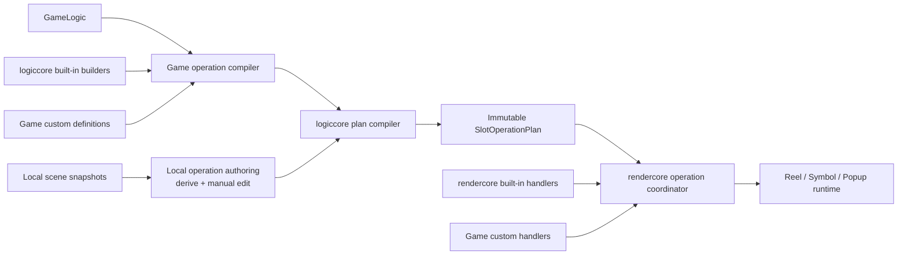

# 可扩展 Slot Operation Plan 设计

> 状态：历史合同（Task 173）；已由 Task 178 的 `SlotOperationPlanV2` 取代，不是当前 API。
> `logiccore` 负责可信 IR/finalize，`rendercore` 负责实例级 registry/coordinator，
> 本地 snapshot 推导只存在于 `@slotclientengine/slotoperationauthoring`。

## 当前正式 API

- `logiccore/slot-operation`：`compileSlotOperationPlan()`、
  `finalizeAuthoredSlotOperationPlan()`、strict component selector、built-in definitions、
  snapshot/plan validation 与 deep freeze。
- `@slotclientengine/slotoperationauthoring`：exact/ambiguous/unresolved suggestion、strict
  project parser 和 review-gated finalizer；不得被正式游戏 runtime 依赖。
- `rendercore/slot-operation`：实例级 exact kind/version registry、完整 plan preflight、
  `prepare/start/update/commit/rollback/destroy` coordinator 与 cell choreography executor。
- Game Viewer 2 外层项目为 v3；v2 只能显式升级为 `review: required` 草稿。launch v3
  必须携带 finalized operation plan，runtime 在加载画面资源前核对全部 checkpoint。
  Operations 编辑器逐 edge 显示 suggestion/candidate/diagnostic，并允许编辑本地注册 kind 与
  完整 payload；任何修改重新进入 required，只有编译结果与目标 snapshot 精确闭合才能接受。
- game002 的 BaseGame 和同一 server response 的 FreeGame 由同一个 coordinator 顺序执行；
  FreeGame 是 `game002:freegame@1`，multiplier/CO 事实随 transform operation payload 携带。

configured adapter 与 game002 已直接调用 `compileSlotRoundOperationPlan()`；旧 public
`SlotRoundExecutionPlan`、compiler、adapter 和 fixed coordinator export 已删除。配置 profile
trace 仍是 `logiccore` 的私有编译实现，rendercore 只保留具名 profile presentation handler。
game002 会把私有 profile transform trace 展开为 WL increment、wild multiplier、WM→CN、
coin multiplier、CM→CN 与 CO collect 原子 operation；每个 visual commit 都由对应 handler
暂停/提交后再进入下一项。Game Viewer 2 finalized plan 由同一 coordinator 执行，settled
画面只从 `operation.output` 提交；snapshot 项目只负责 choreography 与 authoring checkpoint。

## 背景

此前 `SlotRoundExecutionPlan` 由 `logiccore` 编译，固定包含 `win`、`dropdown`、
`refill` 和 `settled-transform` 四种 execution step。该模型已经能够在画面 mutation
前验证完整 round、保存 occurrence identity，并由 `rendercore` coordinator 顺序播放。

但复杂游戏会在同一个 server step 中包含多个有独立提交边界的业务操作。例如
game002 可能依次执行：

1. 上一轮中奖 WL multiplier 墠加；
2. WM 更新全部 WL multiplier；
3. WM 转为 CN；
4. CM 乘全部 CN value；
5. CM 转为 CN；
6. CO 搬运 source occurrence；
7. source 转为 BN，CO 转为 selected symbol；
8. 进入后续 win、collect 和 remove。

旧实现把这些状态变化压缩到一个 `settled-transform` 的最终 `input/output`，中间
数据保存在 game002 presentation batch，顺序与 commit barrier 则由
`Game002RoundTarget` 状态机隐式表达。这能支持当前固定流程，但 plan 本身不能完整
回答中间状态、操作依赖、原子提交边界和 operation-specific capability。

目标是把 round 表达为一份有序、不可变、可扩展的 typed operation plan：游戏拥有
业务编译权，`logiccore` 拥有正式 server 数据选择、状态连续性验证和最终 plan 构造
权，`rendercore` 通过实例级 handler registry 执行 built-in 或游戏自定义
operation。面向 Game Viewer 2 的 scene 推导和人工补全属于独立的本地 authoring
边界，不进入正式游戏的 server round 编译路径。

## 设计目标

- 一轮只生成一份 operation plan，plan 内包含任意数量的有序 operation。
- scene、presentation value 和 occurrence identity 的每个可观察原子提交都有明确的
  `input/output`。
- 游戏通过纯 compiler 和 custom operation definition 注入业务语义，但不能绕过
  `logiccore` 的索引、状态连续性和 occurrence 校验。
- `logiccore` 不认识具体游戏 symbol、component 或动画名。
- `rendercore` 提供 built-in handler 和实例级 registry；游戏通过 public capability
  注册自定义 handler，不复制 reel、symbol、Spine 或 transaction 状态机。
- 正式游戏只从 `GameLogic/component` 读取权威数据，不使用本地 scene 推导补齐缺失
  的 server component/result/pos。
- Game Viewer 2 可以从相邻 snapshot 生成 operation 建议，并通过人工编辑补齐歧义或
  不可推导字段；完成编辑后生成与正式游戏相同的 operation IR。
- 本地推导能力与正式 `logiccore` 编译器隔离；需要共享时放入独立 authoring package。
- 全部 operation 和 renderer capability 在首次画面 mutation 前完成校验与 preflight。

## 非目标

- 不把 Pixi object、renderer callback、Spine player 或 DOM object 放入 logic plan。
- 不让 `logiccore` 硬编码 `WL`、`WM`、`CM`、`CN`、`CO` 等游戏 symbol。
- 不根据 scene 猜测金额、result group、业务触发原因或非唯一 occurrence relocation。
- 不让正式游戏在 component/result/pos 缺失时自动切换到本地推导路径。
- 不把 `Mult_Start -> Mult_Idle -> Mult_End` 等纯动画内部阶段强制拆成语义 operation。
- 不让 Game Viewer 2 伪造 server step 或 component graph。
- 不使用进程级全局 operation definition/handler 注册表。

## 总体流程



正式游戏和本地 viewer 只在 operation 的 source/compile adapter 上不同：正式游戏
使用权威 component selector，本地 viewer 使用推导建议与人工编辑。只有无 unresolved
字段的 authored operation 才能进入最终 plan；最终 plan 和 render execution contract
相同。

## Operation IR

### 公共 envelope

概念接口如下，最终名称可在实现时调整：

```ts
interface SlotOperationBase<
  Kind extends string,
  Version extends number,
  Source,
  Payload,
> {
  readonly id: string;
  readonly kind: Kind;
  readonly version: Version;
  readonly stepIndex: number;

  readonly source: Source;
  readonly input: SlotRoundOccurrenceSnapshot;
  readonly output: SlotRoundOccurrenceSnapshot;
  readonly payload: Payload;

  readonly requiredCapabilities: readonly string[];
  readonly commit: "atomic";
}
```

一轮 plan：

```ts
interface SlotOperationPlan<
  Operation extends SlotOperationBase<any, any, any, any>,
> {
  readonly kind: "slot-operation-plan";
  readonly version: 1;
  readonly initial: SlotRoundOccurrenceSnapshot;
  readonly operations: readonly Operation[];
  readonly final: SlotRoundOccurrenceSnapshot;
  readonly requiredCapabilities: readonly string[];
}
```

`SlotRoundOccurrenceSnapshot` 继续同时保存：

- `scene[x][y]`：可见 symbol code；
- `values[x][y]`：presentation value；
- `occurrences[]`：稳定 identity、code、symbol、value 和 position。

`logiccore` 必须逐项验证：

```text
plan.initial == operations[0].input
operations[n].output == operations[n + 1].input
operations.at(-1).output == plan.final
```

### Operation source

Operation source 使用 strict union，至少区分 server component 与本地 snapshot：

```ts
type SlotOperationSource =
  | ServerComponentOperationSource
  | SnapshotAuthoredOperationSource;

interface ServerComponentOperationSource {
  readonly kind: "server-component";
  readonly stepIndex: number;
  readonly bindings: Readonly<Record<string, ComponentSelection>>;
}

interface SnapshotAuthoredOperationSource {
  readonly kind: "snapshot-authored";
  readonly inputSnapshotId: string;
  readonly outputSnapshotId: string;
  readonly suggestions: readonly AuthoringSuggestionEvidence[];
  readonly edits: readonly AuthoringEditEvidence[];
}
```

Game Viewer 2 必须使用 `snapshot-authored`，不得为复用接口而制造假的 server
component。`suggestions/edits` 用于追踪本地内容怎样从 snapshot 形成最终 operation，
但最终 operation payload 本身必须完整且无歧义。

### Component selection

Operation 不保存语义不明的平行 `scenes[]/otherScenes[]/results[]/positions[]` 数据袋。
每种 operation 应通过具名 role 绑定 component 数据：

```ts
interface ComponentSelection {
  readonly componentName: string;
  readonly componentIndex?: number;
  readonly scenes: readonly IndexedSceneSelection[];
  readonly otherScenes: readonly IndexedOtherSceneSelection[];
  readonly results: readonly IndexedResultSelection[];
  readonly positions: readonly SlotRoundPosition[];
}
```

例如 game002 WM operation 的 `source.bindings` 可以使用：

```ts
{
  generatedWm: selectScene("bg-genwm"),
  wmValues: selectOtherScene("bg-setwm"),
  updatedWilds: selectOtherScene("bg-updwl"),
  wmReplacement: selectScene("bg-wm2cn"),
  generatedCoins: selectOtherScene("bg-genwmcn"),
}
```

每个 selection 保存原始 step/component/index 证据和规范化后的不可变值。raw flat
`pos` 在 selector/builder 边界转为 `{x, y}[]`，不得让 renderer 再解释 server 编码。

## 编译接口

### 游戏 compiler

游戏通过注入的纯 compiler 决定本轮有哪些 operation：

```ts
interface SlotOperationProgramCompiler<CustomDraft extends SlotOperationDraft> {
  compile(
    context: SlotOperationCompileContext,
  ): readonly (BuiltinSlotOperationDraft | CustomDraft)[];
}
```

概念调用方式：

```ts
const plan = compileSlotOperationPlan({
  logic,
  compiler: game002OperationCompiler,
  definitions: game002OperationDefinitions,
  symbolCodes,
  columns,
  rows,
});
```

游戏 compiler 可以读取 `GameLogic`，但优先使用 `logiccore` selector 和 built-in
builder，避免在 app 重复实现 `usedScenes`、`usedOtherScenes`、`usedResults`、
cardinality、index 和 flat position 解析。

游戏返回有序 operation draft，不直接伪造最终可信 plan。`logiccore` 以当前 snapshot
为输入逐个调用 definition，构造 output、验证 identity/continuity 并深冻结 operation。

### Custom operation definition

游戏可以注册 custom operation definition：

```ts
interface SlotOperationDefinition<Draft, Operation> {
  readonly kind: Operation["kind"];
  readonly version: Operation["version"];

  compile(context: {
    readonly logic: GameLogic;
    readonly input: SlotRoundOccurrenceSnapshot;
    readonly draft: Draft;
    readonly helpers: SlotOperationCompileHelpers;
  }): SlotOperationCompileResult<Operation>;

  validate(operation: Operation): void;
}
```

Definition 由 game app 提供，执行入口由 `logiccore` 调用。它必须是 renderer-free 纯
逻辑，不得捕获 Pixi/runtime owner。`logiccore` 对 custom output 继续执行通用校验：

- scene/value dimensions 与 code catalog；
- occurrence identity 唯一性和连续性；
- change position 与 input occurrence 对齐；
- relocation source/target disjoint；
- overwritten target 和 source replacement 显式存在；
- output snapshot 与 changes/relocations 一致；
- required capability 非空、唯一且可识别；
- operation/source/payload 深冻结且不包含 function 或 renderer object。

Kind 应使用 namespace 和 version，例如：

```text
game002:wild-multiplier@1
game002:coin-multiplier@1
game002:co-collect@1
```

不得依赖进程级 declaration merging 或全局 mutable registry，避免多游戏、测试和版本
之间相互污染。

## Logiccore built-in operations

建议首批内置：

| Kind                          | 语义                                                         |
| ----------------------------- | ------------------------------------------------------------ |
| `slot:spin@1`                 | 使用本地公开轮带滚动并落定到权威 target snapshot             |
| `slot:win@1`                  | 规范化 result group、amount、occurrence 和 presentation role |
| `slot:remove@1`               | release occurrence 并生成 hole                               |
| `slot:dropdown@1`             | 保持 occurrence identity 的列内移动和 held occurrence        |
| `slot:refill@1`               | 只在 hole 创建新 occurrence                                  |
| `slot:update-values@1`        | 保持 occurrence/code，只更新 presentation value              |
| `slot:replace-occurrences@1`  | 原位替换 code/value，显式定义 identity policy                |
| `slot:relocate-occurrences@1` | 跨格搬运 source identity，保存 overwritten/replacement       |
| `slot:collect@1`              | 规范化 collect item/group、顺序和金额分配                    |

`wild-multiplier`、`coin-multiplier`、`CO` 等包含具体游戏业务的类型不进入
logiccore built-in。简单游戏可以组合通用 operation；需要整体动画和事务边界时由游戏
定义 custom operation。

正式游戏的 built-in builder 只接受 component 名、symbol policy 和 amount policy
等参数，由 builder 负责选择并严格验证权威数据。例如：

```ts
context.builtins.dropdown({
  stepIndex,
  componentName: "bg-dropdown",
  heldSymbols: ["WL"],
  valuesComponentName: "bg-dropdown",
});
```

正式 builder 不接受 `component-or-derived` fallback。某个 component 在 server 合同中
本来就是可选时，builder 可以显式接受 `zero-or-one` cardinality，但其缺失语义必须由
该 operation 的正式业务合同定义，不能调用本地 authoring 推导补值。

## 本地 Scene 推导与人工编辑

### Package 边界

Scene 推导只服务 Game Viewer 2 一类本地 authoring 环境，不属于正式 round 编译器。
建议在实现时建立独立 package，例如暂名：

```text
packages/slotoperationauthoring
```

该 package 可以依赖 `logiccore` 的 operation/snapshot 类型，但不得依赖 netcore、live
session 或具体游戏 app。它负责：

- 比较相邻 `scene/otherScene`；
- 生成 operation kind、position、movement、replacement 等候选建议；
- 标记 exact、ambiguous 和 unresolved 字段；
- 接受编辑器显式选择、修改或补录；
- 对最终 authored operation 做严格 closure 校验；
- 输出可交给正式 operation plan compiler/finalizer 的完整 draft。

如果继续保持 Game Viewer 2 只直接依赖 rendercore，则由 rendercore authoring facade
转出该 package 的接口；如果允许 Game Viewer 2 直接依赖新的纯 authoring package，
需要同步更新对应依赖合同。无论采用哪种导出方式，正式游戏 runtime 都不依赖该
package。

### Authoring suggestion，而非 runtime fallback

本地推导结果不是自动进入 runtime 的权威值，而是交给编辑器的建议：

```ts
interface AuthoringSuggestion<Value> {
  readonly status: "exact" | "ambiguous" | "unresolved";
  readonly candidates: readonly Value[];
  readonly inspectedPositions: readonly SlotRoundPosition[];
  readonly diagnostics: readonly string[];
}
```

- `exact`：只有一个合法推导，编辑器可以预填，但仍允许用户审阅。
- `ambiguous`：存在多个合法候选，编辑器要求用户明确选择或改写。
- `unresolved`：scene 无法提供所需业务信息，编辑器要求用户手工录入。

任何 `ambiguous/unresolved` 字段在人工编辑完成前不得生成可播放/可导出的最终
operation。人工编辑是本地 authoring 的显式数据来源，不是 silent fallback。

### 推导 API

独立 authoring package 提供 renderer-free、无随机猜测的纯函数：

```ts
suggestSceneChanges(options): AuthoringSuggestion<readonly SceneCellChange[]>;
suggestRemovePositions(options): AuthoringSuggestion<readonly SlotRoundPosition[]>;
suggestRefillPositions(options): AuthoringSuggestion<readonly SlotRoundPosition[]>;
suggestValueUpdates(options): AuthoringSuggestion<readonly OccurrenceValueUpdate[]>;
suggestSymbolReplacements(options): AuthoringSuggestion<readonly SymbolReplacement[]>;
suggestDropdownMovements(options): AuthoringSuggestion<DropdownDerivation>;
suggestOccurrenceRelocations(options): AuthoringSuggestion<RelocationDerivation>;
```

编辑完成后由 finalizer 输出 proof，而不只输出 `pos`：

```ts
interface AuthoredOperationProof<Value> {
  readonly kind: "snapshot-authored";
  readonly value: Value;
  readonly input: SlotRoundOccurrenceSnapshot;
  readonly output: SlotRoundOccurrenceSnapshot;
  readonly suggestions: readonly AuthoringSuggestionEvidence[];
  readonly edits: readonly AuthoringEditEvidence[];
}
```

这样最终 operation 能保存建议、人工修订、输入输出和诊断证据，测试也可以验证完整
状态迁移。

### 可推导边界

| 数据                                | Scene 是否足以推导                |
| ----------------------------------- | --------------------------------- |
| remove hole positions               | 可以                              |
| refill hole positions               | 可以                              |
| code replacement positions          | 可以                              |
| value update positions              | 可以                              |
| dropdown movement                   | 给定 held/order policy 后通常可以 |
| occurrence relocation               | 唯一时可预填；多解时交给人工选择  |
| win result positions                | 不一定；缺失部分由人工补录        |
| result 分组与 usedResults 顺序      | 不可以；由人工编排                |
| cash/coin amount                    | 不可以；需要人工提供              |
| sequential collect 业务顺序         | 不一定；由人工确认或重排          |
| CO source-target 配对               | 通常不可以；由人工配对            |
| multiplier 来源                     | 不可以；需要人工提供              |
| scene 不变时需要播放的 symbol state | 不可以；由人工选择 choreography   |
| 业务触发原因                        | 不可以；由人工选择 operation kind |

Scene diff 只能证明状态效果，不能自动恢复业务意图。非唯一推导不得根据遍历顺序、首
项、相邻格或 symbol code 相同等条件自动选一个；它应保留全部合法候选并交给人工编辑。
如果 scene 完全不能提供某项业务数据，则创建 unresolved 字段，由用户补录。完成编辑
后的 operation 必须重新执行 occurrence、value、position 和 snapshot closure 校验。

## Rendercore handler registry

### 实例级注册

`rendercore` 提供 operation coordinator 和实例级 registry：

```ts
const handlers = createSlotOperationHandlerRegistry();

handlers.registerBuiltins({
  spin: createSpinOperationHandler(runtime),
  remove: createRemoveOperationHandler(runtime),
  dropdown: createDropdownOperationHandler(runtime),
  refill: createRefillOperationHandler(runtime),
});

handlers.register(
  "game002:wild-multiplier@1",
  createGame002WildMultiplierHandler(runtime),
);
```

Custom handler 代码留在游戏 app，通过 rendercore public capability 实现；rendercore
包不得反向 import game002。禁止进程级 `registerGlobalHandler()`，避免不同游戏实例、
版本和测试互相污染。

### Handler 生命周期

```ts
interface SlotOperationHandler<Operation> {
  preflight(operation: Operation): void;
  prepare(operation: Operation): PreparedOperation;
  start(prepared: PreparedOperation): void;
  update(
    prepared: PreparedOperation,
    deltaSeconds: number,
  ): { readonly completed: boolean };
  commit(prepared: PreparedOperation): void;
  rollback(prepared: PreparedOperation): void;
  destroy(prepared: PreparedOperation): void;
}
```

Coordinator 在任何 mutation 前验证：

1. 每个 `kind@version` 有且只有一个 handler；
2. handler 声明的 operation type 与 plan payload 匹配；
3. required capabilities 全部存在；
4. plan-specific resource 和 symbol-state capability preflight 成功；
5. prepare 不修改宿主画面，失败时完整 rollback/destroy。

执行成功时在 operation 完成后校验 runtime snapshot 与 `operation.output`。执行失败时
rollback 当前未提交 transaction，并进入 fatal cleanup。cleanup/destroy 必须幂等。

### Operation 与动画 choreography

Operation 表达语义 commit，handler 表达如何到达该状态。仅动画内部阶段不必成为
operation。例如：

```text
Mult_Start -> Mult_Idle -> Mult_End -> Change
```

可以留在同一个 WM handler；但 `WM -> CN` 改变 occurrence code/renderer identity，
必须有明确的 operation output 或 custom operation 内显式的原子 commit 结果。

简单 operation 可以消费类似 Game Viewer 2 的 renderer-free symbol-state program：

```ts
interface OperationCellChoreography {
  readonly assignments: readonly (readonly string[])[];
  readonly completionPolicy: "all-cells-normal" | "first-cell-normal";
}
```

复杂 operation 可以由 custom handler 管理并行、barrier 和 transaction，但不得绕过
operation input/output 和 capability preflight。

## Game Viewer 2 对接

Game Viewer 2 当前的 `scene-other-scene-flow` 已经具备：

- 有序 `snapshots[]`；
- 每个 snapshot 的 `scene/otherScene`；
- 每格 choreography assignment；
- named state sequence；
- spin 与 settled transition；
- completion policy 和 generation retirement。

其概念映射为：

| Game Viewer 2          | Operation plan               |
| ---------------------- | ---------------------------- | ---------------------- |
| 上一个 snapshot        | `operation.input`            |
| 当前 snapshot          | `operation.output`           |
| `scene`                | output symbol codes          |
| `otherScene`           | output presentation values   |
| `transition: spin      | settled`                     | operation kind/handler |
| `choreographies[x][y]` | cell presentation assignment |
| `completionPolicy`     | handler completion barrier   |

Game Viewer 2 不应为了本地推导而依赖 server framework。推导能力由独立 authoring
package 提供；可以经 rendercore local-flow/operation authoring facade 暴露，也可以在
更新依赖合同后由 Game Viewer 2 直接依赖该纯 authoring package。正式 runtime 路径不
加载这部分代码。

Game Viewer 2 的工作流是“建议 -> 人工编辑 -> strict finalize”，而不是一次性自动
推导：

```ts
const suggestion = suggestSettledOperation({
  input: previousSnapshot,
  output: currentSnapshot,
  allowedEffects: ["update-values", "replace-occurrences", "remove", "refill"],
  choreography: currentSnapshot.choreographies,
  completionPolicy: currentSnapshot.completionPolicy,
});

const editedDraft = editOperationSuggestion(suggestion, userEdits);

const operation = finalizeAuthoredOperation({
  input: previousSnapshot,
  output: currentSnapshot,
  draft: editedDraft,
});
```

编辑器应允许用户：

- 选择建议的 operation kind 或改为其它已注册 kind；
- 增删、重排或修正 positions；
- 为 relocation 明确 source/target 配对；
- 补录 result group、collect order、amount 或其它 scene 不包含的数据；
- 选择 symbol-state choreography 和 completion policy；
- 查看推导依据、冲突位置和未完成字段。

`finalizeAuthoredOperation()` 只有在全部 required 字段完成、position/identity/value 和
input/output closure 均通过后才返回 operation；否则保留为可继续编辑的 project draft，
不能进入 preview/runtime plan。

Production operation 不能退化成单纯的 `applyScene()`，仍需保存 dropdown movement、
relocation identity、release IDs、replacement transaction 和真实 spin landing boundary。

## Game002 示例

一个包含 WM、CM 和 CO 的 server step 可以编译为：

```text
slot:update-values@1
  上一步中奖 WL multiplier +1

game002:wild-multiplier@1
  WM 动画并更新 WL value

slot:replace-occurrences@1
  WM -> CN，提交 intermediate CN value

game002:coin-multiplier@1
  CM 动画并批量更新全部 CN value

slot:replace-occurrences@1
  CM -> CN

game002:co-collect@1
  source occurrence -> target
  source -> BN
  CO -> selected symbol

slot:win@1
  bg-win/bg-win2 result groups

slot:remove@1
  bg-remove/bg-bn release
```

具体是否合并相邻 operation 由原子提交边界决定，而不是由 server component 数量决定：

- scene、value 或 occurrence identity 发生可观察提交时，应形成 operation output；
- 只播放动画且语义状态不变时，留在 handler 内部；
- 同批并行动画和原子 mutation 可以放在一个 operation；
- 需要独立 rollback、重放或诊断的 mutation 不应被压成最终大 diff。

## 验证与错误策略

- 未知 operation kind/version 显式失败。
- 重复 definition 或 handler 显式失败。
- component role、cardinality、index、scene dimensions、result 和 pos 全部严格校验。
- 正式游戏缺少 operation 合同要求的 component/result/pos 时显式失败，不调用本地
  authoring 推导。
- custom operation 不能声明无法由其 changes/relocations 证明的 output。
- operation chain 任一 input/output 不连续即拒绝整轮。
- 所有 handler preflight 在 next-spin cleanup 和 initial mutation 前完成。
- 不提供 default operation、首项 handler fallback、kind alias 或静默 presentation 降级。
- Game Viewer 2 scene diff 有多个合法解释时保留候选并要求用户显式选择或编辑，不能
  自动采用第一个解释；unresolved 字段阻止 finalize，但不阻止用户继续编辑 project。

## 迁移建议

建议增量迁移，保留旧 plan adapter 直到直接 consumer 完成切换：

1. 在 `logiccore` 新增 operation base、server source evidence 和实例级 definition
   registry，不立即删除现有 `SlotRoundExecutionPlan`。
2. 把现有 spin、win、remove、dropdown、refill 编译器提取为 built-in operation
   builders，并用 parity 测试证明旧 plan 与新 operation trace 一致。
3. 新增独立本地 authoring package，提供 suggestion、人工 edit draft 和 strict
   finalize 接口，不进入正式游戏 runtime 依赖链。
4. 让 game002 multiplier compiler 输出多个 typed operation draft，移除
   `Game002WlWmMultiplierPresentationBatch` 中与 operation 重复的状态数据。
5. 把 `Game002RoundTarget` 的 WM、CM、CO 分支拆成实例级 custom handlers。
6. 在 rendercore 抽取 Game Viewer 2 当前逐格 once/stable choreography executor，供
   local flow 和简单 operation handler 共同使用。
7. 让 Game Viewer 2 从相邻 snapshot 生成 suggestions，支持人工补全后输出
   snapshot-authored operations。
8. 迁移 configured scene-layout round adapter 和其它直接 consumer。
9. 所有消费者完成 parity、failure、rollback 和 replay 验证后，再删除旧固定 step union。

## 验收重点

- 相同 `GameLogic` 重复编译产生深相等、深冻结的 operation plan。
- built-in 和 custom operation 的 source evidence 能定位原始 step/component/index。
- 正式游戏 required component/result/pos 缺失时在 mutation 前失败。
- 每个 operation 的 output 与下一个 input 完全一致。
- dropdown/refill/relocation 跨 operation 保持 occurrence identity 和 value continuity。
- handler 缺失、版本不符或 capability 缺失在 cleanup/mutation 前失败。
- prepare/start/commit 任一阶段失败都不留下半提交画面或资源泄漏。
- Game Viewer 2 exact 建议可直接预填；ambiguous 建议保留全部候选；unresolved 字段可由
  人工补录；未完成 draft 不得 finalize 或播放。
- 人工编辑后的 authored operation 重新通过 dimensions、position、occurrence、value 和
  snapshot closure 校验。
- Game Viewer 2 replay 从 initial snapshot 重建完整 operation flow，不复用旧 generation。
- game002 WM -> CN intermediate value、CM 后 final value 和 CO relocation 在 operation
  边界均可独立断言，不再依赖读取 Target 私有 phase 才能解释。
